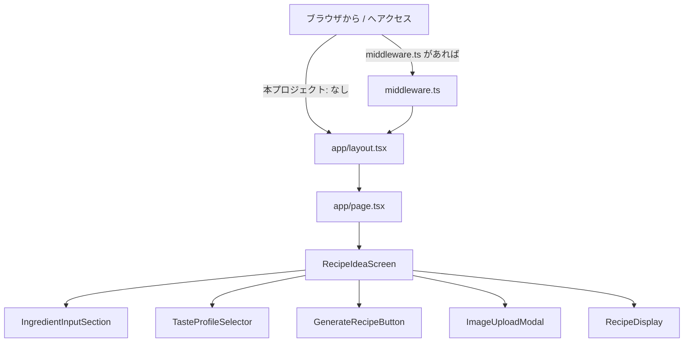
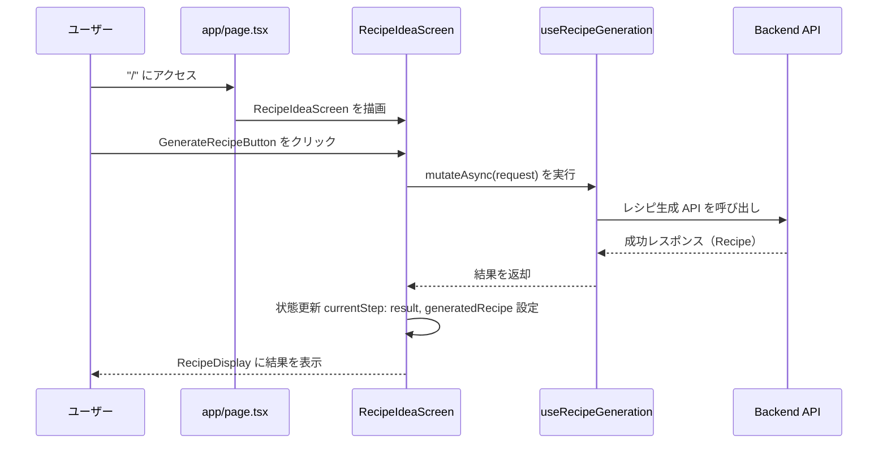

## フロントエンドの処理順（Next.js App Router／本プロジェクト）

- 現在このリポジトリには `middleware.ts` は存在しません（リポジトリ直下の `frontend/` 配下にも未定義）。
- そのため、`/` へのリクエスト時は Next.js の標準フローで `app/layout.tsx` → `app/page.tsx` の順に評価され、`page.tsx` が画面の起点となります。
- `page.tsx` は `RecipeIdeaScreen`（統合画面）を描画し、そこから各機能コンポーネントが連携します。

### レシピ生成操作時のフロー

### メモ
- `middleware.ts` は存在する場合のみ最初に実行されます（ルーティング前）。本プロジェクトでは未定義のため、最初に確認するファイルは `app/layout.tsx` と `app/page.tsx` になります。
- `app/page.tsx` は `'use client'` 指定のクライアントコンポーネントで、実際の画面制御は `RecipeIdeaScreen` に集約されています。

