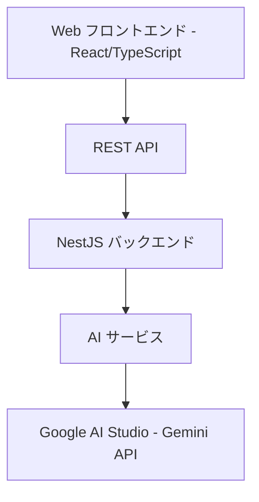

# 設計書

## 概要

AI料理アプリのMVPは、ユーザーが食材の画像をアップロードし、食材名を入力することで、AIがレシピを生成するシンプルなWebアプリケーションです。

## アーキテクチャ

### システム全体構成



### 技術スタック

**フロントエンド:**
- React 18 with TypeScript(Next.js)
- Tailwind CSS (シンプルなスタイリング)
- React Hook Form + Zod (フォーム管理)
- TanStack Query  (HTTP クライアント)

**バックエンド:**
- Hono with TypeScript
- Hono/Validator (Zod / Valibot) (入力検証)

**API設計:**
- TypeSpec (API ドキュメント・型生成)

**AI/ML:**
- Google AI Studio (Gemini API) (画像識別・レシピ生成)

## コンポーネントと インターフェース

### フロントエンドコンポーネント構成

```
src/
├── components/
│   ├── ImageUpload.tsx          - 画像アップロード機能
│   ├── IngredientInput.tsx      - 食材入力フォーム
│   ├── RecipeDisplay.tsx        - 生成されたレシピ表示
│   └── Layout.tsx               - 基本レイアウト
├── services/
│   └── api.ts                   - API通信
├── types/
│   ├── ingredient.ts            - 食材型定義
│   └── recipe.ts                - レシピ型定義
└── App.tsx                      - メインアプリケーション
```

### NestJS バックエンド構成

```
src/
├── modules/
│   ├── recipes/
│   │   ├── recipes.controller.ts - レシピ生成処理（画像+食材）
│   │   ├── recipes.service.ts
│   │   ├── recipes.module.ts
│   │   └── dto/
│   └── ai/
│       ├── ai.service.ts        - Google AI Studio API連携
│       └── ai.module.ts
└── common/
    ├── filters/                 - エラーハンドリング
    └── pipes/                   - バリデーション
```

### API 構成

```
api/
└── main.tsp
    ├── models/
    │   ├── ingredient.tsp
    │   └── recipe.tsp
    └── operations/
        └── recipes.tsp
```

### REST API エンドポイント設計

**レシピ生成API:**
```
POST   /api/recipes/generate     - 画像と食材からレシピ生成
```

### API レスポンス形式

**統一レスポンス形式:**
```typescript
interface ApiResponse<T> {
  success: boolean;
  data?: T;
  error?: {
    code: string;
    message: string;
  };
}
```

## データモデル

### 食材 (Ingredient)

```typescript
interface Ingredient {
  name: string;
}
```

### レシピ生成リクエスト (RecipeGenerationRequest)

```typescript
interface RecipeGenerationRequest {
  ingredients: string[];
  images?: File[]; // フロントエンドから直接送信
}
```

### レシピ (Recipe)

```typescript
interface Recipe {
  title: string;
  description: string;
  ingredients: string[];
  instructions: string[];
  cookingTime?: number; // 分
  servings?: number;
}
```

## エラーハンドリング

### エラー分類と対応

**バリデーションエラー (400):**
- 食材リストが空
- 不正なファイル形式
- ファイルサイズ超過

**外部サービスエラー (502/503):**
- Google AI Studio API接続エラー
- AI レスポンス解析エラー

**サーバーエラー (500):**
- ファイルアップロードエラー
- 予期しないシステムエラー

### エラーレスポンス形式

```typescript
interface ErrorResponse {
  success: false;
  error: {
    code: string;
    message: string;
  };
}
```

## テスト戦略

### テストレベル

**単体テスト:**
- AI サービスのレシピ生成ロジック
- ファイルアップロード処理
- データバリデーション

**統合テスト:**
- API エンドポイント
- Google AI Studio API連携（モック使用）

**E2Eテスト:**
- 画像アップロード→食材入力→レシピ生成の一連の流れ

### テストツール

**フロントエンド:**
- Jest + React Testing Library

**バックエンド:**
- Jest + Supertest

### AI機能のテスト戦略

**レシピ生成テスト:**
- 固定入力に対する出力の構造検証
- Google AI Studio APIレスポンスの解析テスト

## セキュリティ考慮事項

**画像処理:**
- ファイル形式制限 (jpg, png, webp のみ)
- ファイルサイズ制限 (5MB以下)
- 画像は一時的に処理のみ（保存しない）

**API セキュリティ:**
- CORS 設定
- レート制限 (express-rate-limit)

**データ保護:**
- 入力値のサニタイゼーション
- Google AI Studio API キーの環境変数管理

## TypeSpec による API 設計

**TypeSpec の利点:**
- **型安全性** - TypeScriptとの完全な統合
- **コード生成** - クライアント SDK の自動生成
- **ドキュメント生成** - OpenAPI 3.0 仕様の自動生成

**TypeSpec 構成例:**
```typescript
// typespec/models/recipe.tsp
model Recipe {
  title: string;
  description: string;
  ingredients: string[];
  instructions: string[];
  cookingTime?: int32;
  servings?: int32;
}

model RecipeGenerationRequest {
  ingredients: string[];
  // 画像はmultipart/form-dataで送信
}
```

**生成される成果物:**
- OpenAPI 3.0 仕様書
- TypeScript 型定義
- NestJS DTOs
- バリデーションスキーマ